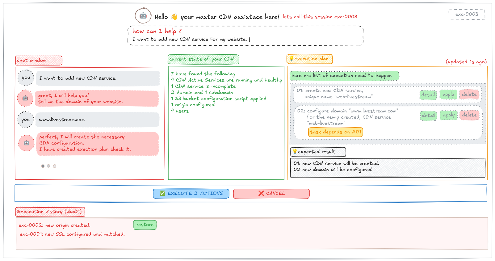

# cdnbuddy (web)

🤖 Your CDN buddy - Just converse with buddy and configure sophisticated CDN setups without needing to know technical configurations. Focus on your business while buddy makes your web blazingly fast!

# example converstaion
```
    You: "Hi, I have a video streaming app and my users in Europe are complaining it's really slow. Can you help?"
    
    CDNBuddy: "Hey! Absolutely, I can help speed up your video streaming for European users. Let me check your current setup first.
               I can see you don't have any CDN configured yet. For video streaming in Europe, I'd recommend setting up a CDN with strong European edge locations.

               check the action plan I have created 😀
```

# conceive



# core architecture
```
cdnbuddy-web (SvelteKit Frontend) ↔ WebSocket ↔ Go Backend Services ↔ CDN SDK
```

## License

This project is licensed under the MIT License - see the [LICENSE](LICENSE) file for details.